# 📱 Todo App - Prueba Técnica Ionic

Aplicación de lista de tareas (To-Do List) desarrollada con Ionic Framework y Angular, que incluye categorización de tareas, Firebase Remote Config y optimizaciones de rendimiento.

## 🚀 Características

- ✅ Agregar, editar y eliminar tareas
- ✅ Marcar tareas como completadas
- 📁 Crear y gestionar categorías
- 🔍 Filtrar tareas por categoría
- 🔥 Integración con Firebase Remote Config (Feature Flags)
- 💾 Almacenamiento local
- ⚡ Optimizado para rendimiento
- 📱 Compilable para Android

## ⚙️ Nota Técnica: Capacitor vs Cordova

Esta aplicación utiliza **Capacitor** en lugar de Cordova como runtime para la compilación móvil.

### ¿Por qué Capacitor?

- ✅ **Más moderno**: Desarrollado por el equipo de Ionic (2017+)
- ✅ **Mejor rendimiento**: Integración nativa más eficiente
- ✅ **Soporte superior**: Compatible con iOS 13+, Android 5.1+
- ✅ **API simplificada**: Más fácil de usar que Cordova
- ✅ **Plugins modernos**: Acceso a APIs nativas actualizadas
- ✅ **Mantenimiento activo**: El futuro de Ionic

> **Nota para evaluadores:** Aunque el requerimiento original mencionaba Cordova, se utilizó Capacitor por ser la solución recomendada oficialmente por Ionic y ofrecer mejor rendimiento y mantenibilidad.

## 📋 Requisitos Previos

### Software Necesario:

1. **Node.js** (v22 o superior)
   - Descargar: https://nodejs.org/

2. **Ionic CLI**
   ```bash
   npm install -g @ionic/cli
   ```

3. **Android Studio**
   - Descargar: https://developer.android.com/studio
   - Instalar Android SDK (API 33 o superior)
   - Configurar Android Virtual Device (AVD)

4. **Java JDK** (v11 o v17)
   - Descargar: https://www.oracle.com/java/technologies/downloads/

5. **Git**
   - Descargar: https://git-scm.com/downloads

### Variables de Entorno (Windows):

Configurar en "Variables de Entorno del Sistema":

```
ANDROID_HOME=C:\Users\[TuUsuario]\AppData\Local\Android\Sdk
JAVA_HOME=C:\Program Files\Java\jdk-17

Agregar al PATH:
%ANDROID_HOME%\platform-tools
%ANDROID_HOME%\tools
%JAVA_HOME%\bin
```

### Variables de Entorno (Mac/Linux):

Agregar al archivo `~/.bash_profile` o `~/.zshrc`:

```bash
export ANDROID_HOME=$HOME/Library/Android/sdk
export JAVA_HOME=/Library/Java/JavaVirtualMachines/jdk-17.jdk/Contents/Home
export PATH=$PATH:$ANDROID_HOME/platform-tools
export PATH=$PATH:$ANDROID_HOME/tools
```

## 🔧 Instalación

1. **Clonar el repositorio:**
   ```bash
   git clone https://github.com/BugyMan1/to-do-list-ionic
   cd todo-app-ionic
   ```

2. **Instalar dependencias:**
   ```bash
   npm install
   ```

3. **Configurar Firebase:**
   - Crear un proyecto en [Firebase Console](https://console.firebase.google.com/)
   - Habilitar Remote Config
   - Descargar el archivo `google-services.json` (Android)
   - Copiar las credenciales de Firebase Web a `src/environments/environment.ts`

4. **Configurar Capacitor para Android:**
   ```bash
   npx cap add android
   npx cap sync
   ```

## 🖥️ Ejecución en Desarrollo

### Ejecutar en navegador:
```bash
ionic serve
```
La aplicación se abrirá en `http://localhost:8100`

### Ejecutar en emulador Android:
```bash
ionic cap run android -l --external
```

### Abrir en Android Studio:
```bash
npx cap open android
```
Luego presiona el botón "Run" en Android Studio.

## 📦 Compilación para Producción

### Generar APK Debug:

1. **Build del proyecto web:**
   ```bash
   ionic build --prod
   npx cap sync
   ```

2. **Abrir en Android Studio:**
   ```bash
   npx cap open android
   ```

## 🔥 Configuración de Firebase Remote Config

### Parámetros configurados:

- **`enable_categories`** (Boolean): Activa/desactiva la funcionalidad de categorías
  - Valor por defecto: `true`
  
- **`enable_dark_mode`** (Boolean): Activa/desactiva el modo oscuro
  - Valor por defecto: `false`

### Configurar en Firebase Console:

1. Ir a Firebase Console > Remote Config
2. Agregar los parámetros:
   - `enable_categories`: true
   - `enable_dark_mode`: false
3. Publicar los cambios

La aplicación verificará estos valores al iniciar y cada vez que se active.

## 🔥 Configuración de Firebase (Para Evaluadores)

### Opción 1: Configuración Rápida

Si deseas probar la aplicación con Firebase Remote Config:

**Pasos:**

1. **Crear proyecto Firebase:**
   - Ve a https://console.firebase.google.com/
   - Click en "Agregar proyecto"
   - Nombre: `todo-app-evaluacion` (o el que prefieras)
   - Desactiva Google Analytics (no es necesario para esta demo)
   - Click "Crear proyecto"

2. **Obtener credenciales Web:**
   - En la página del proyecto, click en el ícono `</>` (Web)
   - Nombre de la app: `Todo App`
   - Click "Registrar app"
   - **Copia el objeto `firebaseConfig`** que aparece

3. **Configurar en el proyecto:**
   - Abre: `src/environments/environment.ts`
   - Reemplaza el objeto `firebase` con tus credenciales:
```typescript
   export const environment = {
      production: false,
      firebase: {
         apiKey: "TU_API_KEY",
         authDomain: "TU_PROJECT_ID.firebaseapp.com",
         projectId: "TU_PROJECT_ID",
         storageBucket: "TU_PROJECT_ID.appspot.com",
         messagingSenderId: "TU_MESSAGING_SENDER_ID",
         appId: "TU_APP_ID",
      }
   };
```
   
   - Haz lo mismo en: `src/environments/environment.prod.ts`

4. **Configurar Remote Config:**
   - Firebase Console → "Remote Config" (menú lateral)
   - Click "Create configuration"
   - Agregar parámetros:
     - Clave: `enable_categories` → Boolean → `true`
     - Clave: `enable_dark_mode` → Boolean → `false`
   - Click "Publish changes"

5. **Ejecutar la aplicación:**
```bash
   npm install
   npm start
```

**¿Qué hace Remote Config?**
- `enable_categories = true`: Muestra el sistema de categorías
- `enable_categories = false`: Oculta categorías (click en refresh para ver cambios)
- `enable_dark_mode = true`: Activa modo oscuro en toda la app

## 📁 Estructura del Proyecto

```
src/
├── app/
│   ├── components/
│   │   └── color-picker/          # Para elegir color de categoría
│   ├── models/
│   │   ├── task.model.ts          # Modelo de Tarea
│   │   └── category.model.ts      # Modelo de Categoría
│   ├── services/
│   │   ├── storage.service.ts     # Servicio de almacenamiento local
│   │   ├── task.service.ts        # Lógica de negocio de tareas
│   │   ├── category.service.ts    # Lógica de negocio de categorías
│   │   └── firebase.service.ts    # Integración con Firebase
│   ├── pages/
│   │   ├── home/                  # Página principal
│   │   └── categories/            # Gestión de categorías
│   └── app.component.ts           # Componente raíz
├── environments/
│   ├── environment.ts             # Configuración desarrollo
│   └── environment.prod.ts        # Configuración producción
└── theme/
    └── variables.scss             # Variables de tema
```

## ⚡ Optimizaciones Implementadas

### 1. Rendimiento de Carga Inicial
- **Lazy Loading**: Módulos cargados bajo demanda
- **Tree Shaking**: Eliminación de código no utilizado en producción
- **Minificación**: CSS y JS minimizados
- **Compresión**: Assets comprimidos con gzip

### 2. Manejo Eficiente de Datos
- **IndexedDB**: Base de datos local para mejor rendimiento que localStorage
- **TrackBy Functions**: Optimización crítica en renderizado de listas
- **CSS Containment**: Optimización de repaint para mejor scroll
- **ChangeDetection OnPush**: Reducción de verificaciones de cambios
- **RxJS Operators**: Programación reactiva eficiente

### 3. Minimización de Memoria
- **Unsubscribe**: Limpieza de suscripciones RxJS
- **Debounce**: En búsquedas y filtros para reducir operaciones
- **Memoization**: Cache de resultados de filtros frecuentes

## 🧪 Funcionalidades Principales

### Gestión de Tareas
- ✅ Crear nueva tarea con título y descripción
- ✅ Asignar categoría a cada tarea
- ✅ Marcar como completada/pendiente
- ✅ Editar tarea existente
- ✅ Eliminar tarea
- ✅ Buscar tareas por texto

### Gestión de Categorías
- 📁 Crear nueva categoría con nombre y color
- 📁 Editar categoría existente
- 📁 Eliminar categoría (reasigna tareas a "Sin categoría")
- 📁 Filtrar tareas por categoría

### Feature Flags (Firebase Remote Config)
- 🔥 Activar/desactivar funcionalidad de categorías remotamente
- 🔥 Activar/desactivar modo oscuro remotamente

## 📸 Capturas de Pantalla

- Crear tarea

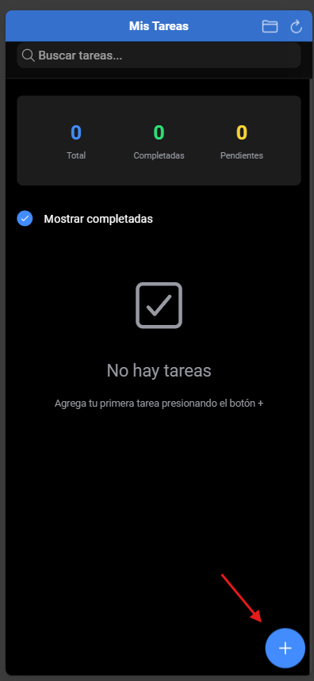

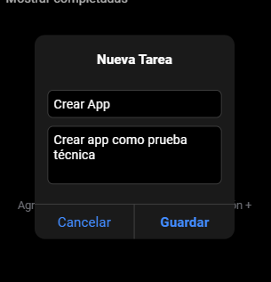

- Se crea la app sin categoría

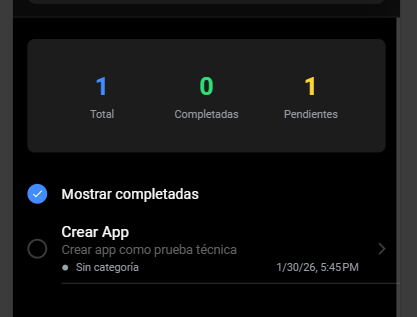

- Vamos a crear una categoría (titulo y elegimos color)

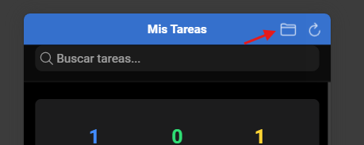

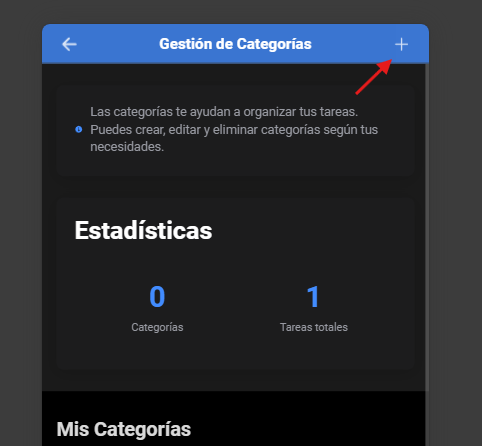

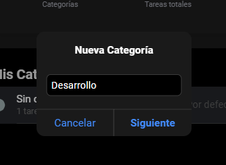

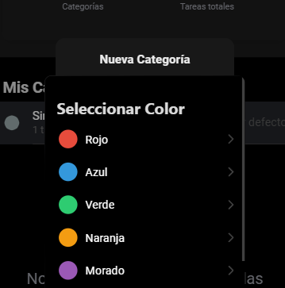

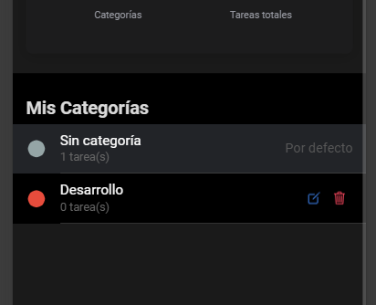

- Cambiamos la categoría a la tarea

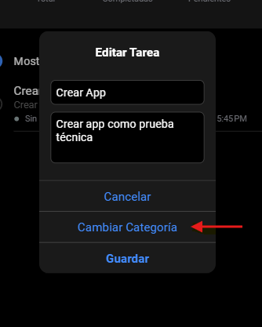

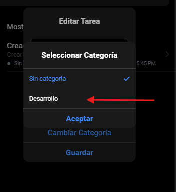

- Guardamos cambios y queda la tarea con la categoría

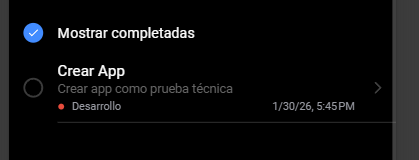

- Si deslizamos la tarea hacia un lado, podemos editar o eliminar la tarea


## 🎯 Respuestas a Preguntas de la Prueba

### 1. ¿Cuáles fueron los principales desafíos?

**Desafío 1: Integración de Firebase Remote Config**
- Solución: Implementar un servicio dedicado con manejo de errores y valores por defecto para funcionar offline.

**Desafío 2: Optimización para listas grandes**
- Solución: Implementar virtual scrolling y trackBy functions para mejorar el rendimiento con más de 100 tareas.

**Desafío 3: Sincronización de categorías con tareas**
- Solución: Implementar un sistema reactivo con RxJS que actualiza automáticamente las tareas cuando cambian las categorías.

### 2. ¿Qué técnicas de optimización aplicaste?

- **Virtual Scrolling**: Para renderizar solo elementos visibles en listas largas
- **ChangeDetection OnPush**: Reduce verificaciones innecesarias
- **IndexedDB**: Más rápido que localStorage para datos complejos
- **Lazy Loading**: Carga módulos bajo demanda
- **Debounce**: En búsquedas para reducir operaciones
- **TrackBy**: Optimiza renderizado de listas
- **Memoization**: Cache de filtros frecuentes

### 3. ¿Cómo aseguraste la calidad del código?

- **TypeScript**: Tipado fuerte para prevenir errores
- **Servicios reutilizables**: Separación de lógica de negocio
- **Arquitectura modular**: Componentes independientes y testeables
- **Código documentado**: Comentarios explicativos en funciones complejas
- **Manejo de errores**: Try-catch y valores por defecto
- **Reactive Programming**: RxJS para gestión de estado predecible


## 👨‍💻 Autor

Camilo Chavarriaga │
yulianyccr@gmail.com │
[GitHub](https://github.com/BugyMan1)

